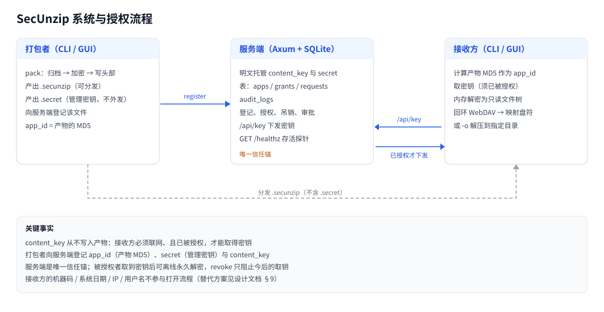
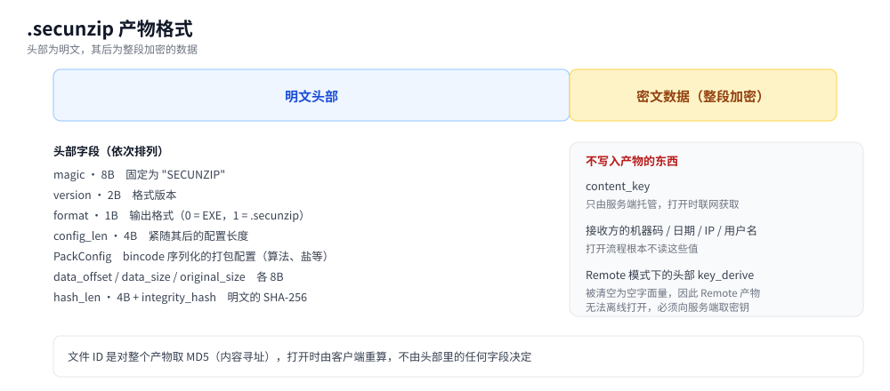
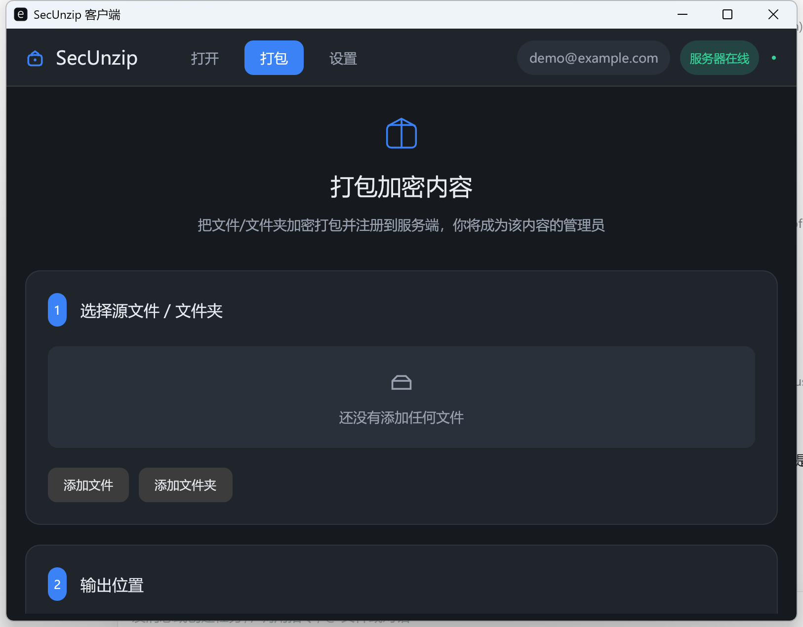
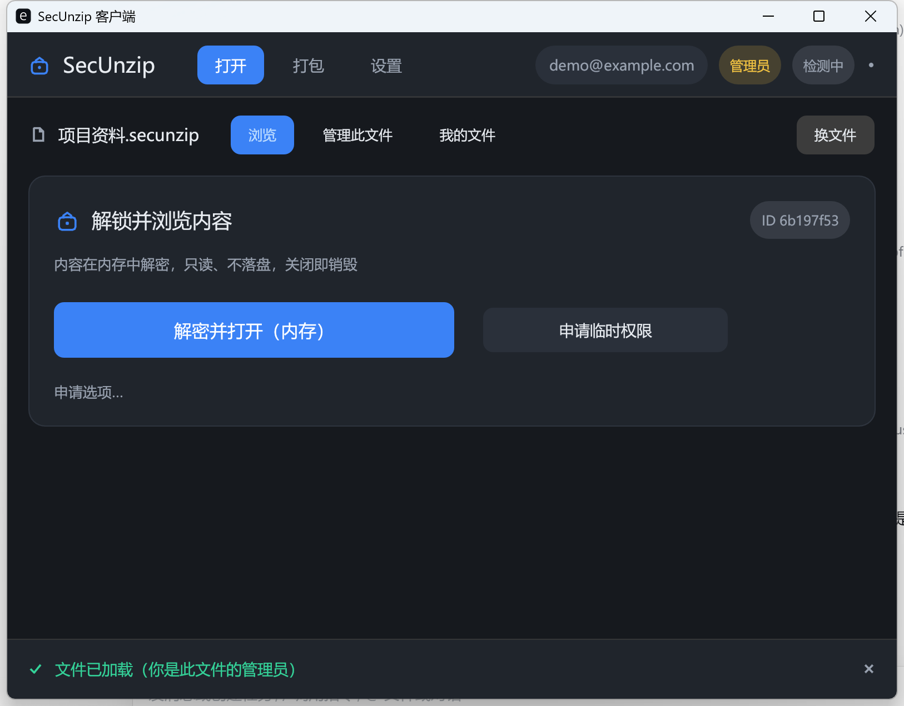
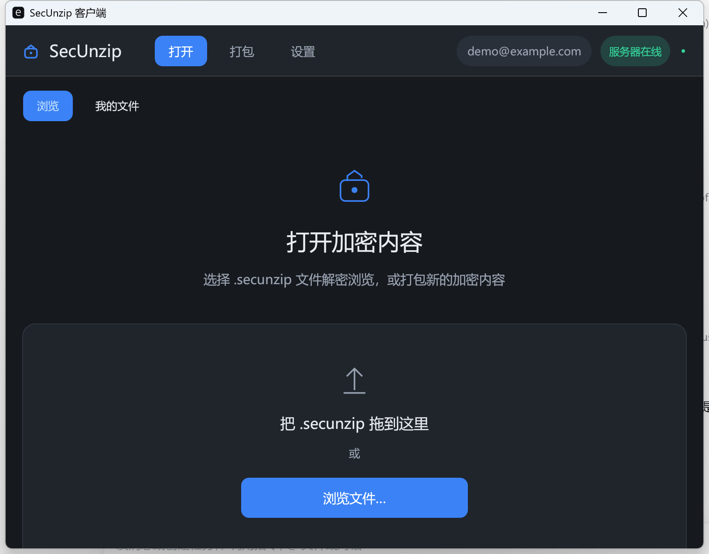
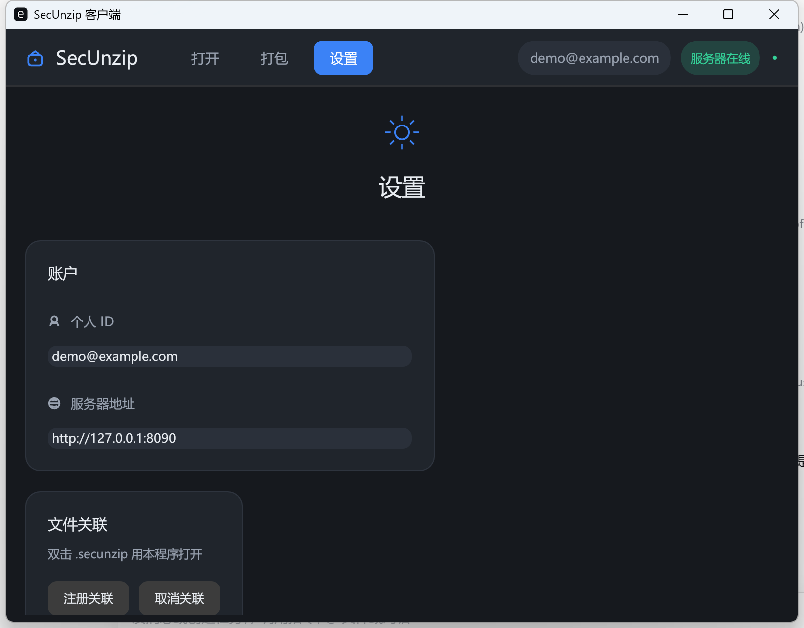

# secunzip

> 学生项目，非安全产品。未做安全审计与渗透测试，服务端默认明文 HTTP。请仅在隔离的虚拟机或沙盒中试用，
> 不要用于真实敏感数据，不要暴露到公网。已知风险逐条列在 [SECURITY.md](SECURITY.md)。
>
> 课程作业完成后**不再维护**：不承诺修复缺陷，不承诺回复 issue 与 PR。下面「实现状态」一节说明哪些能力
> 真正可用、哪些只停留在设计与文档里，请以该表为准。

受控内容分发工具。把文件打包成 `.secunzip`，接收方必须联网、且被授权，才能打开。

内容先归档为 ZIP，再整体加密。加密密钥由服务端托管，打开时联网获取；默认在内存中解压浏览，不落盘。

```
secunzip pack ./docs -o docs.secunzip --server http://192.168.1.10:8090
secunzip grant docs.secunzip -u alice@example.com
secunzip open  docs.secunzip -u alice@example.com
```

## 架构



打包者把内容归档后整体加密，并把 `content_key` 登记到服务端；接收方打开时先算产物 MD5 作为文件 ID，
联网取回密钥后才能解密，内容默认只在内存中以只读文件树呈现。**`content_key` 从不写入产物。**



头部是明文，依次为魔数、版本、格式、配置长度、bincode 序列化的打包配置、三段长度与明文的 SHA-256
完整性哈希；其后是整段加密的数据。文件 ID 是对整个产物取 MD5，不由头部任何字段决定。

## 实现状态

核心链路是完整且经过端到端验证的：打包 → 归档加密 → 服务端登记与授权 → 接收方联网取密钥 →
内存只读浏览。围绕它有不少能力只存在于设计与文档中，下表如实区分。判断依据是代码，不采信注释。

| 能力 | 状态 | 说明 |
|------|------|------|
| 打包、加密、服务端授权与密钥下发 | 已实现 | AES-256-GCM 为默认，`content_key` 由服务端托管 |
| 内存只读浏览（CLI 与 GUI） | 已实现 | 默认不落盘，只有显式 `-o` 才解压到目录 |
| WebDAV 挂载为盘符 | 已实现 | 回环地址上的只读 WebDAV，经系统自带 WebClient 映射，盘符自动选择 |
| 服务端授权有效期、审批流、审计日志 | 已实现 | 服务端侧完整，含 schema 迁移与审计保留 |
| 安装包与 `.secunzip` 文件关联 | 已实现 | Windows |
| 黑盒自解压 EXE | 已实现 | GUI 与 CLI（`pack --blackbox`）都可产出；runner 是打包工具自身的二进制，启动时先自查尾部标记，命中即进入黑盒打开流程 |
| 密钥派生流程（`KeyNode` 树） | 部分实现 | 流程只在**打包机**求值一次并冻结为密钥字符串；接收方的机器码、系统日期、IP、用户名在打开时不会被读取 |
| 「沙箱 / 内存执行」EXE | 未实现 | 实际是写临时目录后调用资源管理器打开 |
| RunPE 内存执行 | 未实现 | 有实现代码但零调用点，且默认不编译；设计文档曾把它标为已完成 |
| IP 白名单 | 已实现（服务端强制） | `/api/key` 按 TCP 连接的对端地址校验，管理员同样受限；经 TCP 转发或反向代理访问时，服务端看到的是代理地址而非客户端地址 |
| 本地认证模式（`AuthMode::Local`） | 未实现 | `open` 直接拒绝 |
| 文件内有效期（`expire_at`） | 未实现 | 生产路径恒为空，只有服务端侧的授权有效期生效 |
| 运行模式（沙箱 / 文档 / 落盘） | 未实现 | 字段只写不读，三种模式无行为差别 |
| 算法矩阵 | 部分实现 | XChaCha20 已实现；SM4、SM3 返回「尚未实现」错误而非 panic；7z、tar.zst、tar.gz 返回错误而非静默按 ZIP 处理 |

各条的具体机制与证据见 [docs/design.md](docs/design.md) 与 [docs/technical.md](docs/technical.md)。

## 界面







四个页面的完整走查（含实际输出）见 [docs/demo.md](docs/demo.md)；界面取色与控件风格在 [gui/src/theme.rs](gui/src/theme.rs)，图标是 [gui/src/icons.rs](gui/src/icons.rs) 里手写的矢量绘制。

## 仓库结构

| 路径 | 内容 |
|------|------|
| [src/](src/) | 核心库 + CLI：[core/](src/core/) 类型与产物格式、[crypto/](src/crypto/) 加密与哈希、[key_derive/](src/key_derive/) 密钥派生、[packer/](src/packer/) 打包、[runtime/](src/runtime/) 加载与挂载、[cli/](src/cli/) 命令行 |
| [server/](server/) | 授权服务端（Axum + SQLite），全部逻辑在 [src/main.rs](server/src/main.rs) |
| [gui/](gui/) | 图形客户端（egui）：[theme.rs](gui/src/theme.rs) 设计系统、[icons.rs](gui/src/icons.rs) 手搓矢量图标、[model.rs](gui/src/model.rs) 状态与持久化、[monitor.rs](gui/src/monitor.rs) 后台监控、[views/](gui/src/views/) 各页面、[app.rs](gui/src/app.rs) 业务逻辑、[api.rs](gui/src/api.rs) HTTP 调用 |
| [tests/](tests/) | 集成测试 |
| [testdata/](testdata/) | 手工试用用的示例数据（见 [docs/demo.md](docs/demo.md)；自动化测试自建临时文件） |
| [docs/](docs/) | [设计文档](docs/design.md)、[技术方案清单](docs/technical.md)、[演示脚本](docs/demo.md)、[发布与卸载](docs/release.md)，截图在 [docs/images/](docs/images/) |
| [.github/](.github/) | [ci.yml](.github/workflows/ci.yml) 在提交与 PR 时跑格式检查、clippy 与测试；[release.yml](.github/workflows/release.yml) 打 tag 时产出并发布安装包 |
| [deploy/](deploy/) | 部署脚本与 Docker，见 [deploy/README.md](deploy/README.md) |
| [assets/](assets/) | 打包用的运行时占位资源 |
| [installer.iss](installer.iss) | Inno Setup 安装包脚本 |

### 文件清单

**根目录**

| 文件 | 说明 |
|------|------|
| [Cargo.toml](Cargo.toml) / [Cargo.lock](Cargo.lock) | 核心库与 CLI 的依赖清单与锁定版本；含发布构建优化（LTO、strip） |
| [.gitignore](.gitignore) | 忽略构建产物（`target/`、`output/`）与运行时数据（`*.db`、`*.secret`） |
| [.gitattributes](.gitattributes) | 换行符策略：仓库内存 LF，避免 `deploy/install-linux.sh` 被 Windows 提交成 CRLF |
| [.editorconfig](.editorconfig) | 编辑器缩进与编码约定 |
| [rustfmt.toml](rustfmt.toml) | rustfmt 配置，CI 用 `cargo fmt --check` 校验 |
| [LICENSE](LICENSE) | MIT 许可证 |
| [DISCLAIMER.txt](DISCLAIMER.txt) | 免责声明：学生项目、未做安全审计、建议沙盒试用；安装包首屏强制阅读 |
| [README.md](README.md) | 本文件 |
| [API.md](API.md) | 服务端 HTTP 接口参考 |
| [TESTING.md](TESTING.md) | 测试范围、手工验证步骤与回归清单 |
| [SECURITY.md](SECURITY.md) | 安全状态、信任模型与已知接受的风险 |
| [CONTRIBUTING.md](CONTRIBUTING.md) | 构建方式、测试要求与提交约定 |
| [CODE_OF_CONDUCT.md](CODE_OF_CONDUCT.md) | 参与者行为准则（Contributor Covenant 2.1） |
| [CHANGELOG.md](CHANGELOG.md) | 版本变更记录 |
| [ATTRIBUTION.md](ATTRIBUTION.md) | 技术与第三方组件归属声明 |
| [installer.iss](installer.iss) | Inno Setup 6 安装包脚本，产出 `SecUnzip-Setup.exe`（含卸载程序） |
| [.github/workflows/ci.yml](.github/workflows/ci.yml) | 提交与 PR 时跑 `cargo fmt --check`、`cargo clippy -D warnings` 与全部测试 |
| [.github/workflows/release.yml](.github/workflows/release.yml) | 推 `v*` tag 时自动构建安装包并挂到 Release |
| [.github/PULL_REQUEST_TEMPLATE.md](.github/PULL_REQUEST_TEMPLATE.md) | PR 自查清单 |
| [.github/ISSUE_TEMPLATE/](.github/ISSUE_TEMPLATE/) | issue 表单：缺陷报告与功能建议 |
| [build.rs](build.rs) | 把 `assets/icon.ico` 嵌入可执行文件（三个 crate 各一份）；`rc`/`windres` 不在 PATH 时回退到 Windows Kits 与 MSYS2 的默认安装位置 |

**核心库与 CLI（`src/`）**

| 文件 | 说明 |
|------|------|
| [src/lib.rs](src/lib.rs) | crate 根：声明并导出各模块 |
| 各 `mod.rs` | 模块声明与再导出：`src/core/`、`src/crypto/`、`src/key_derive/`、`src/packer/`、`src/runtime/`、`src/cli/`、`gui/src/views/` |
| [src/main.rs](src/main.rs) | CLI 入口：解析子命令并分发 |
| [src/core/types.rs](src/core/types.rs) | 核心类型：`PackConfig`、加解密/压缩/哈希算法枚举、`KeyNode` |
| [src/core/config.rs](src/core/config.rs) | 打包产物头部 `PackHeader` 的读写与字段布局（bincode） |
| [src/core/error.rs](src/core/error.rs) | 统一错误类型 `SecUnzipError` |
| [src/crypto/traits.rs](src/crypto/traits.rs) | `Encryptor` / `Hasher` trait 与按算法创建实例的工厂 |
| [src/crypto/aes.rs](src/crypto/aes.rs) | AES-256-CBC 与 AES-256-GCM 两种实现（GCM 为认证加密） |
| [src/crypto/chacha.rs](src/crypto/chacha.rs) | ChaCha20 实现 |
| [src/crypto/hash.rs](src/crypto/hash.rs) | SHA-256/512、BLAKE3、MD5；文件 ID（产物 MD5）计算 |
| [src/crypto/keywrap.rs](src/crypto/keywrap.rs) | PBKDF2-HMAC-SHA256 派生出加密密钥与 IV |
| [src/key_derive/engine.rs](src/key_derive/engine.rs) | 密钥派生流程引擎：按 `KeyNode` 树确定性求值 |
| [src/key_derive/sources.rs](src/key_derive/sources.rs) | 派生来源：机器码 / 本机 IP / 日期 / 域用户 / 字面量 / 盐 |
| [src/packer/builder.rs](src/packer/builder.rs) | 打包主流程：归档 → 加密 → 写头部；黑盒 EXE 的组装 |
| [src/packer/compress.rs](src/packer/compress.rs) | ZIP 归档 |
| [src/runtime/loader.rs](src/runtime/loader.rs) | 产物加载：校验完整性 → 解密 → 交给 VFS 或执行器 |
| [src/runtime/vfs.rs](src/runtime/vfs.rs) | 内存虚拟文件系统：目录树、读取、文本/图片判定 |
| [src/runtime/executor.rs](src/runtime/executor.rs) | 解压后运行：内存执行 / 临时目录 / 调用系统打开 |
| [src/runtime/mount.rs](src/runtime/mount.rs) | 把 VFS 挂载为盘符或 WebDAV 服务 |
| [src/runtime/selfextract.rs](src/runtime/selfextract.rs) | 黑盒 EXE 自解压：识别尾部标记并取出内嵌产物 |
| [src/runtime/runpe.rs](src/runtime/runpe.rs) | 内存 EXE 执行（进程挖坑）；仅 `--features runpe` 时编译 |
| [src/cli/args.rs](src/cli/args.rs) | 子命令与参数定义（clap） |
| [src/cli/commands.rs](src/cli/commands.rs) | 各命令实现与服务端 HTTP 调用 |

**服务端（`server/`）**

| 文件 | 说明 |
|------|------|
| [server/Cargo.toml](server/Cargo.toml) | 服务端依赖 |
| [server/src/main.rs](server/src/main.rs) | 服务端全部逻辑：9 个接口、鉴权、审计、顺序迁移、审计保留、在线备份 |

**图形客户端（`gui/`）**

| 文件 | 说明 |
|------|------|
| [gui/Cargo.toml](gui/Cargo.toml) | GUI 依赖 |
| [gui/src/main.rs](gui/src/main.rs) | 入口：窗口参数、中文字体加载、控制台输出处理；`--register` / `--unregister` |
| [gui/src/app.rs](gui/src/app.rs) | 应用状态 `SecUnzipApp`、业务逻辑与渲染入口 |
| [gui/src/theme.rs](gui/src/theme.rs) | 设计系统：配色、主题、通用组件（卡片 / 按钮 / 徽章 / 分区标题 / 居中列） |
| [gui/src/icons.rs](gui/src/icons.rs) | 手搓矢量图标（`Painter` 绘制，无 emoji、无图标字体） |
| [gui/src/model.rs](gui/src/model.rs) | 界面状态枚举与本地持久化（`config.json` / `packed.json`） |
| [gui/src/monitor.rs](gui/src/monitor.rs) | 后台线程：服务器连通性探测与待审批自动拉取 |
| [gui/src/api.rs](gui/src/api.rs) | 服务端 HTTP 调用 |
| [gui/src/register.rs](gui/src/register.rs) | Windows 下注册 `.secunzip` 文件关联 |
| [gui/src/views/chrome.rs](gui/src/views/chrome.rs) | 顶栏（页签 + 服务器状态灯）与底部状态栏 |
| [gui/src/views/setup.rs](gui/src/views/setup.rs) | 首次使用的设置页 |
| [gui/src/views/open.rs](gui/src/views/open.rs) | 打开页：文件选择器 / 我打包的文件 / 内容浏览 |
| [gui/src/views/manage.rs](gui/src/views/manage.rs) | 管理此文件：授权、吊销、审批 |
| [gui/src/views/pack.rs](gui/src/views/pack.rs) | 打包页 |
| [gui/src/views/settings.rs](gui/src/views/settings.rs) | 设置页 |

**资源、测试、部署与文档**

| 文件 | 说明 |
|------|------|
| [assets/README.md](assets/README.md) | 资源目录说明 |
| [assets/icon.ico](assets/icon.ico) | 应用图标（16–256 多尺寸，蓝底白锁），由 `build.rs` 嵌入 exe，安装包快捷方式亦指向它 |
| [assets/runtime_stub.exe](assets/runtime_stub.exe) | 打包黑盒 EXE 时的编译期占位回退（11 字节，必须存在） |
| [testdata/hello.txt](testdata/hello.txt)、[testdata/readme.md](testdata/readme.md) | 手工试用用的示例数据，可直接 `secunzip pack ./testdata -o t.secunzip` |
| [tests/algorithm_test.rs](tests/algorithm_test.rs) | 未实现的压缩算法与密钥派生变换必须报错，不得静默替换或原样放行 |
| [tests/cli_blackbox_test.rs](tests/cli_blackbox_test.rs) | `pack --blackbox` 参数解析、CLI 黑盒 EXE 的尾部标记与内嵌产物 |
| [tests/crypto_test.rs](tests/crypto_test.rs) | 加密往返、GCM 篡改检测、XChaCha20、哈希与 KDF |
| [tests/key_derive_test.rs](tests/key_derive_test.rs) | 派生流程节点求值与确定性 |
| [tests/packer_test.rs](tests/packer_test.rs) | 打包/解包往返、有效期、错密钥、info |
| [tests/security_test.rs](tests/security_test.rs) | content_key 不落文件、注册失败不留死文件、黑盒自解压 |
| [deploy/README.md](deploy/README.md) | 服务端部署说明 |
| [deploy/Dockerfile](deploy/Dockerfile)、[deploy/docker-compose.yml](deploy/docker-compose.yml) | Docker 部署 |
| [deploy/install-windows.ps1](deploy/install-windows.ps1)、[deploy/install-linux.sh](deploy/install-linux.sh) | 一键部署，并生成服务化脚本（NSSM / systemd） |
| [docs/design.md](docs/design.md) | 设计文档 |
| [docs/technical.md](docs/technical.md) | 技术方案清单 |
| [docs/demo.md](docs/demo.md) | 演示脚本：可照着跑的完整流程与答辩要点 |
| [docs/release.md](docs/release.md) | 发布与卸载说明 |

## 构建

需要 Rust stable。

```
cargo build --release --workspace      # 一次构建三个 crate
```

产物：根目录 `target/release/` 下的 `secunzip`、`secunzip-server`、`secunzip-gui`（workspace 共用一份 target）。

## 命令

```
secunzip pack <源路径...> -o <输出> --server <地址> [--allow-temp] [--blackbox]
secunzip open <文件> -u <用户ID> [-o <解压目录>]
secunzip grant <文件> -u <用户ID> [-e <有效期>]
secunzip revoke <文件> -u <用户ID>
secunzip request <文件> -u <用户ID> [--days N] [--message <说明>]
secunzip requests <文件>
secunzip approve <文件> -u <用户ID> [-e <有效期>]
secunzip deny <文件> -u <用户ID>
```

`-e/--expires` 接受 `7d`（N 天后）或 `YYYYMMDD`，省略为永久。
命令定义见 [src/cli/args.rs](src/cli/args.rs)。

`pack` 产出两个文件：

- `xxx.secunzip` — 加密产物，可对外分发
- `xxx.secret` — 该文件的管理密钥，用于 grant/revoke/approve/deny，不要与产物一起发出去

管理端命令默认从产物同目录的 `.secret` 读取密钥，也可用环境变量 `SECUNZIP_SECRET` 覆盖。

## 服务端

```
cd server
./secunzip-server                       # 监听 0.0.0.0:8090
SECUNZIP_PORT=9000 ./secunzip-server    # 换端口
```

数据存工作目录下的 `secunzip.db`（SQLite，启动时自动建表）。服务端源码见 [server/src/main.rs](server/src/main.rs)，
接口见 [API.md](API.md)，部署脚本见 [deploy/README.md](deploy/README.md)。

## GUI

```
cd gui && cargo run
```

- 「打开」页：拖入 `.secunzip` 浏览内容；未加载文件时列出本机打包过的文件
- 「打包」页：选择源、输出路径、服务端地址
- 「设置」页：用户ID、服务端地址

配置位于 `%USERPROFILE%\Documents\SecUnzip\`（`config.json`、`packed.json`）。GUI 源码见 [gui/src/](gui/src/)。

## 平台支持

| 组件 | Windows | Linux x86_64 | macOS |
|------|---------|--------------|-------|
| CLI | 构建并测试 | 未验证 | 未验证 |
| 服务端 | 构建 | 构建、部署并运行（Ubuntu 24.04 / glibc 2.39） | 未验证 |
| GUI | 构建 | 未验证 | 未验证 |

CLI 与 GUI 中含有 `#[cfg(not(windows))]` 分支，可编译到非 Windows 平台，但尚未验证。

以下功能仅 Windows 可用：

- 读取 MachineGuid 作为密钥派生来源（`winreg`）
- 盘符挂载
- `--features runpe` 的内存执行
- 黑盒自解压 EXE（产物为 PE，需 Windows 打开）

`.secunzip` 产物本身与平台无关，任何平台的客户端都能打开。

## 运行要求

- 服务端：一个可写目录（存放 `secunzip.db`）和一个监听端口（默认 8090），无外部数据库或中间件
- 客户端：能通过 HTTP 访问服务端即可
- GUI：需要桌面窗口系统（eframe 原生渲染，不依赖浏览器）
- 构建：Rust stable；Windows 上使用 `x86_64-pc-windows-gnu`（mingw）

## 依赖与安装

三个可执行文件都是自包含的原生二进制，**不需要任何第三方运行时**：

- Windows：只依赖系统 DLL（kernel32 / msvcrt / ws2_32 / bcrypt / crypt32 等），**不需要 VC++ Redistributable**（MinGW 工具链，链接系统自带的 `msvcrt.dll`）
- SQLite 以 `bundled` 方式编译进服务端二进制，**不需要系统安装 libsqlite3**
- 不需要 Python / Node / JRE / 外部数据库

已知约束：

- Windows：需要含相应 API set 的系统（约 Win8+）
- Linux 服务端受 **glibc 版本**约束 —— 在 glibc 2.39（Ubuntu 24.04）上构建，目标机过低会无法运行；要兼容旧发行版请改用 musl 目标
- macOS：未验证

### 安装包

[installer.iss](installer.iss) 是 [Inno Setup 6](https://jrsoftware.org/isinfo.php) 脚本，`iscc installer.iss` 产出 `output/SecUnzip-Setup.exe`：

- 安装 GUI、CLI、服务端三个可执行文件，以及 [deploy/](deploy/) 脚本与文档
- 创建开始菜单与（可选）桌面快捷方式
- 可选注册 `.secunzip` 文件关联（写 HKCU）
- 按用户安装（`PrivilegesRequired=lowest`），不需要管理员
- 自带卸载程序：安装时生成 `unins000.exe`，并注册到 Windows「应用和功能」

**安装包不安装任何依赖** —— 因为它打包的二进制本身没有依赖（见上）。

发布产物的构成、卸载入口与构建方式见 [docs/release.md](docs/release.md)；
推 `v*` tag 会触发 CI 自动构建并挂到 Release（`.github/workflows/release.yml`，尚未实跑验证）。

## 安全

明文 HTTP 传输，`content_key` 与 `secret` 会过网，只应部署在可信内网；对外必须前置 TLS 反向代理。

服务端明文托管所有 `content_key`，是唯一的信任锚。

客户端为解密必然拿到密钥，因此**授权一次即可永久离线解密**；`revoke` 只阻止今后的取钥，
无法追回已泄露的密钥。

威胁模型与已知问题见 [SECURITY.md](SECURITY.md)，设计取舍见 [docs/design.md](docs/design.md)。

## 测试

```
cargo test                      # 核心库与 CLI：73 个
cd server && cargo test         # 服务端：30 个（3 个单元 + 27 个集成），真实拉起进程打 HTTP 接口
```

见 [TESTING.md](TESTING.md)。

## 文档

- [docs/demo.md](docs/demo.md) — 演示脚本：照着敲就能跑通的完整流程（含实际输出与截图）
- [docs/release.md](docs/release.md) — 发布与卸载：安装包内容、卸载入口、如何产出发布件
- [API.md](API.md) — 服务端接口
- [TESTING.md](TESTING.md) — 测试范围与手工验证
- [docs/design.md](docs/design.md) — 设计：架构、产物格式、安全边界
- [docs/technical.md](docs/technical.md) — 技术方案清单（全部选型与实现方案）
- [ATTRIBUTION.md](ATTRIBUTION.md) — 第三方归属
- [SECURITY.md](SECURITY.md) — 安全状态与已知风险
- [CHANGELOG.md](CHANGELOG.md) — 版本变更
- [CONTRIBUTING.md](CONTRIBUTING.md) — 构建、测试与提交约定
- [deploy/README.md](deploy/README.md) — 服务端部署

## License

[MIT](LICENSE)

以 MIT 许可证发布，不提供任何形式的担保。这是学生项目，未做安全审计，请仅在沙盒环境试用，详见 [DISCLAIMER.txt](DISCLAIMER.txt)。
